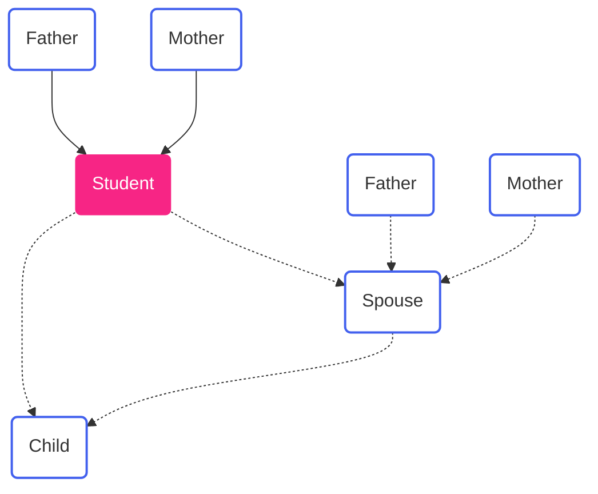

Kl: Grade lists  
Bg: Biographies  
Ft: Census/population register

Instances: 1 or Multiple

## By individuals

| Variable | Source(s) | Instances | Note |
|---|---|---|---|
| ID | | 1 | Created to link each individual across observations |
| Name | Kl, Bg, Ft | 1 | |
| Maiden name | Kl, Bg, Ft | 1 | (if female) |
| Birth date | Bg, (Kl, Ft) | 1 | |
| Birth place | Bg, (Kl, Ft) | 1 | |
| Death date | Bg, (Kl, Ft) | 1 | |
| Death place | Bg, (Kl, Ft) | 1 | |
| Marriage date | Bg | M | Typically 1, but potentially multiple |
| High school | Bg, Kl | 1 | |
| - Graduation date/year | Bg, Kl | 1 | |
| - Study line | Kl, (Bg) | 1 | Eg. Classical or real line |
| - Main grade | Kl, (Bg) | 1 | |
| - Subject grades | Kl | 1* | 1 grade per subject |
| University | Bg, Kl | M | Typically 1, but potentially multiple |
| - Graduation date/year | Bg, Kl | M | Ditto |
| - Degree/qualification | Bg, Kl | M | Ditto |
| - Main grade | Kl, (Bg) | M | Ditto |
| - Subject grades | Kl | 1* | 1 grade per subject |
| Job (title) | Bg | M |  |
| - Start date/year | Bg | M |  |
| - End date/year | Bg | M |  |
| - Employer (incl. location) | Bg | M |  |
| - HISCO class |  | M | To be generated later based on job titles |

## Relation mapping

| Variable | Source(s) | Instances | Note |
|---|---|---|---|
| Student | Kl, Bg, Ft |  | | 
| Father | Bg, Ft, (Kl) | 1 | Birth date, place and occupation |
| Mother | Bg, Ft, (Kl) | 1 | Birth date, place and maiden name |
| Spouse | Bg, Ft | M | Birth date, place and (if female) maiden name |
| Child | Ft, (Bg) | M | Birth date, place -- note: can be more than one! |
